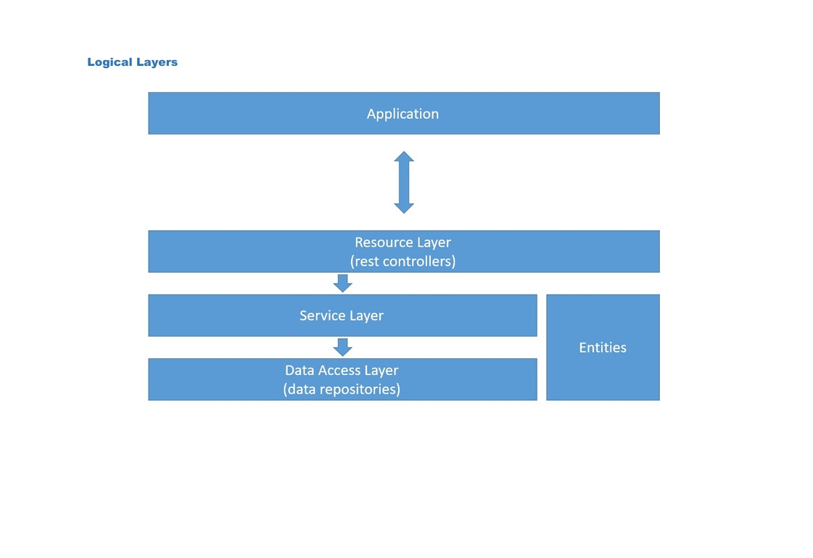

<h1>Gerenciador de pedidos</h1>
<h2>O que é o Projeto</h2>

Basicamente, a proposta é criar uma API que faça o gerenciamente de pedidos de um estabelecimento, e também que seja possível ter 
relatórios dos pedidos com base nos usuários e nos produtos também.

<h2>Solução</h2>

Este Projeto tem o objetivo de gerenciar pedidos aonde é possível cadastrar produtos com categorias atreladas a 
ela, também temos o cadastro de usuários aonde conseguimos ter quais pedidos foram realizados por tal usuário. 
Considerando todos esses pontos, desenvolvi metodos que não estavam previstos na formulação do projeto, como buscas 
de pedidos com base em um produto, busca de pedidos com base no usuário e busca de usuário com base no pedido. Todos os métodos tem endpoints criados em
localhost, por exemplo, para buscar um usuário com base no id é muito simples, basta colocar <strong>localhost:8080/users/{id que desejar}</strong>, já 
para os métodos mais específicos como o buscar pedido com base no usuário, ficará <strong>localhost:8080/orders/user/{id que desejar}</strong>, a
aplicação utiliza esse padrão em todos os endpoints.
Considerei ser necessário essa abordagem, por que acredito que para um estabelecimento seja importante ter relatórios de fluxo de pedidos, até mesmo para que possam montar
uma estratégia de vendas e entender o que mais é consumido pelos clientes. 
Para desenvolver essa solução utilizei a linguagem Java e o Framework Spring-Boot, além de trabalhar com Banco de Dados em memória, o H2 Database.
Lembrando que é perfeitamente possível desenvolver essa solução em outras linguagens e frameworks, eu escolhi essa abordagem por que é a linguagem que
venho me especilizando no momento.

<h2>Possíveis melhorias </h2>
<ul>
<li>Interface de usuário</li>
<li>Criação de usuários e Autenticação com Token JWT</li>
<li>Criptografia de Senha no Banco de Dados</li>
<li>Implementação de testes Unitários com Mockito</li>
</ul>
<h2>Tecnologias utilizadas</h2>
<ul>
<li>Java 21 LTS</li>
<li>Spring-Boot 3</li>
<li>H2 Database</li>
<li>Postman</li>
</ul>
<h2>Arquitetura</h2>

A partir do diagrama de contexto, é possível entender melhor o fluxo da aplicação.

<h2>Como executar</h2>

1. Clonar projeto pelo git: git clone https://github.com/antmarques/workshop-devsuperior.git

2. Instalar dependências: mvn clean install

3. Executar aplicação Spring-Boot por meio de alguma IDE, recomendo o InteliJ que está disponível aqui: 
<a><strong>https://www.jetbrains.com/idea/download/?section=windows</strong></a>. 
Você também vai precisar ter o Java versão 21 na sua máquina, disponível aqui: 
<a><strong>https://www.oracle.com/br/java/technologies/downloads/#java21</strong></a>

4. Testar os endpoints pelo navegador com a URL <a>localhost:8080/</a> ou pelo Postman (recomendo o postman) que está 
disponível aqui (basta criar conta e utilizar pelo navegador mesmo): <a>https://www.postman.com</a>

<h2>Observações</h2>

É uma aplicação bem simples, até mesmo por que foi a minha primeira aplicação criada do zero com Spring-Boot, 
planejo fazer algumas melhorias ainda nela, inclusive, se alguém que olhar esse repositório e ver possíveis melhorias 
que eu não identifiquei, sinta-se a vontade para reportar para mim, tanto pelo meu Linkedim quanto pelo GitHub.

<h3>Desenvolvido por: Antonio Carlos</h3>